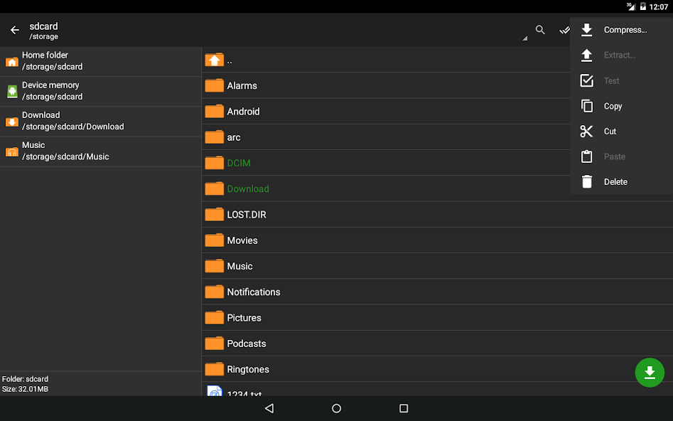
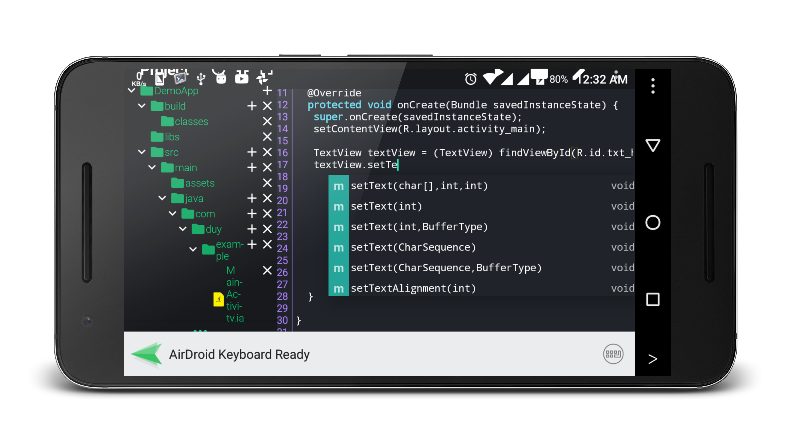
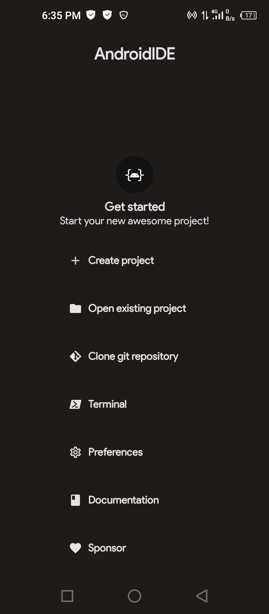
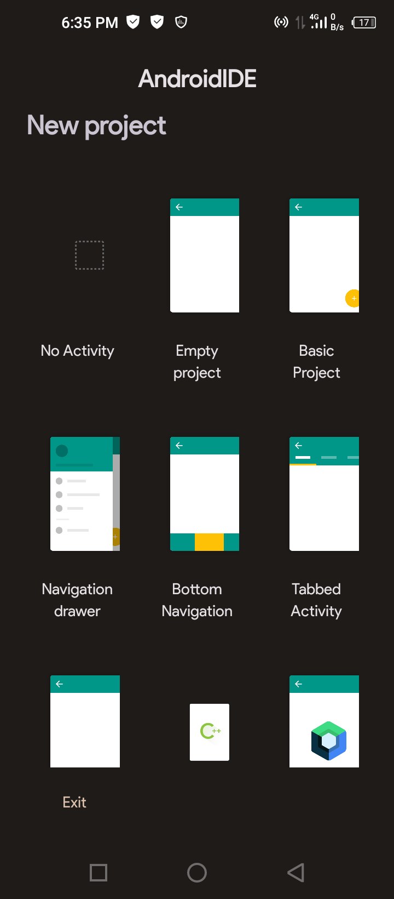
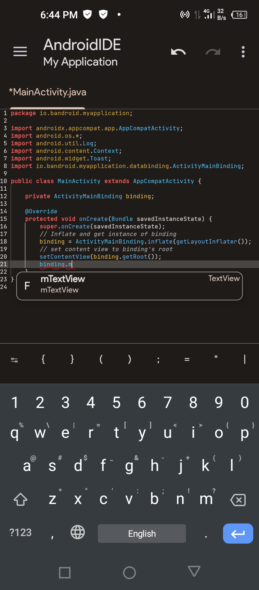

# ⚙️ SoftLinks
📣 SoftLinks is a centralized repository that holds links to all the apps, software, and web apps I use. Here, you can easily explore the platforms that are essential for my work and daily activities. It serves as a resource hub showcasing the tools and services I rely on.
# ---------------Essential But Optional---------------
## 📌 WinRAR ( Windows )
 

## 

#### 🔑 Key
## 

## 📌 ZArchiver ( Android )
 

## 

# -----------------------Platform-----------------------
## 💻 Intellij Idea
 

## 

### ----------------------------END----------------------------

## 🖥️ Android Studio
 

## 

### ----------------------------END----------------------------

## 📱 LDPLAYER
 

## 

### ----------------------------END----------------------------

## 🎬 Admob
 

## 

### ----------------------------END----------------------------

## 🔥 FireBase
 

## 

# -----------------------Design-----------------------
## 🖋️ Adobe XD
 

## 

#### 🔌 Flutter Plugin
## 

#### 🔌 All Plugins
## 

### ----------------------------END----------------------------

## 🎨 Coolors
 

## 

### ----------------------------END----------------------------

## 📦 FLATICON
 

## 

# -----------------------Android Platform-----------------------
## ☕ Java-N-Idea
 

## 

### ----------------------------END----------------------------

## 🐘 AndroidIDE
   

## 

### ----------------------------END----------------------------
